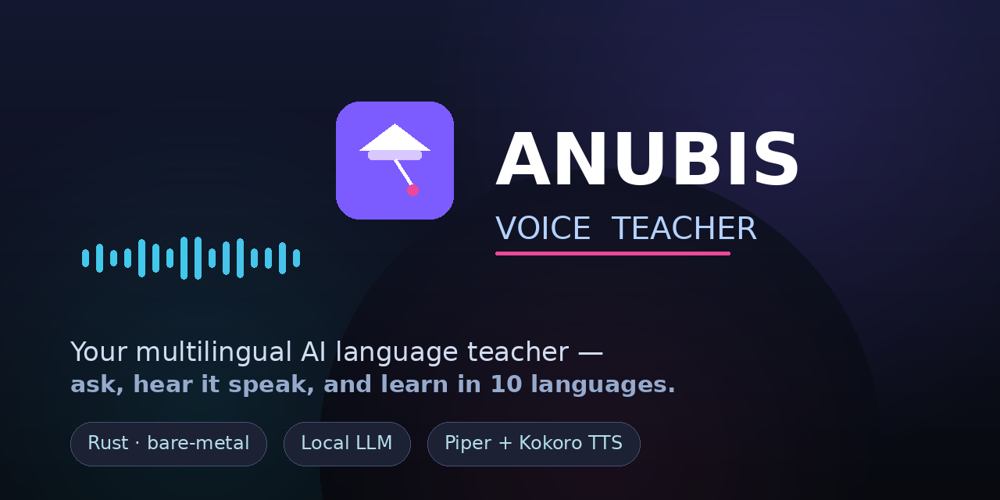

<p align="center">
  
</p>

<p align="center">
  <strong>Local-first, open-source, bare-metal AI voice teacher — written in Rust.</strong><br/>
  A multilingual Telegram **voice teacher** with a streaming real-time WebSocket
  transport, a local LLM "brain", and text-to-speech — all on your own machine.
</p>

<p align="center">
  <a href="#features">Features</a> •
  <a href="#architecture">Architecture</a> •
  <a href="#quickstart">Quickstart</a> •
  <a href="#commands">Commands</a> •
  <a href="#real-time-websocket">WebSocket</a> •
  <a href="#configuration">Configuration</a> •
  <a href="#license">License</a>
</p>

---

Everything runs **locally**. No audio, transcript, or model traffic leaves
your machine unless you explicitly point a sidecar at an external provider.

## Features

| | |
|---|---|
| 🎓 **Voice Teacher** | The core identity: a multilingual AI language teacher. Ask questions in any language, hear your teacher speak back, with real teaching behaviors (explain, Socratic dialogues, practice, feedback, encouragement). |
| 🧠 **Noxis Core** | Local LLM "brain" (llama.cpp / Ollama / OpenAI-compatible). Streaming replies, per-user conversation memory, teacher mode. |
| 🎙 **TTS** | Piper (CPU) + Kokoro (neural sidecar). Real, downloadable voices across 10 languages — all preloaded, **zero user install**. |
| 📦 **Zero-setup voices** | `scripts/download_voices.sh` fetches every catalog model; voice/language auto-switch picks the best voice for each language. |
| 🗣 **Streaming WebSocket** | A real-time opcode transport so web apps / clients get live text deltas **and** audio frames as they're generated. |
| 🌐 **Language-aware voice** | Changing language auto-switches your voice (and UI) to that language's best default. |
| 🎤 **Voice conversation** | Optional: send a voice note → whisper.cpp transcribes locally → Noxis answers → reply in an audible voice. |
| 🌐 **i18n** | Full UI localized in 10 languages (EN/AR/IT/FR/ES/DE/RU/HI/TR/PT). |

## Architecture

```
                       ┌──────────────────────────────────────────────┐
   Telegram  long-poll │  anubis-core (Rust binary)   WebSocket  WS   │
       ▶────────────────┤  • teloxide bot            ◀────────────────┤──▶ Web / mobile clients
                        │  • Noxis Core (LLM client)  • axum WS server │
                        │  • TTS router (Piper / Kokoro)               │
                        │  • SQLite + ffmpeg glue                      │
                        └──────────┬──────────────────┬────────────────┘
                                   │ HTTP/local       │
                                   ▼                  ▼
                      llama.cpp / Ollama           whisper.cpp (:8890)
                           (:8080)
                        Kokoro TTS (:8880)
 ```

Both transports share the **same core** — Noxis, TTS router, whisper, memory,
and DB. The WebSocket transport is a second door into identical backend logic.

## Quickstart

### 1. Prerequisites

- [Rust](https://rustup.rs) (stable)
- [`ffmpeg`](https://ffmpeg.org) on `PATH` (WAV ↔ OGG conversion)
- A Telegram bot token from [@BotFather](https://t.me/BotFather)

### 2. Clone & build

```bash
git clone https://github.com/mastergeeky1-cloud/anubis-core.git
cd anubis-core
cp .env.example .env        # then add your ANUBIS_TELEGRAM_TOKEN
cargo build --release
```

### 3. Configuration

```bash
# Token (REQUIRED) — env only, never in a file next to config
export ANUBIS_TELEGRAM_TOKEN="123:your-token"

# Noxis Core local LLM (llama.cpp-compatible OpenAI-style endpoint)
export ANUBIS_LLM_URL="http://127.0.0.1:8080"      # leave empty to disable /ask
# Optional key for a hosted endpoint (e.g. omniroute):
# export ANUBIS_LLM_URL="https://api.omniroute.ai"  ANUBIS_LLM_KEY="..."

# Sidecars
export ANUBIS_KOKORO_URL="http://127.0.0.1:8880"    # optional Kokoro TTS
export ANUBIS_WHISPER_URL="http://127.0.0.1:8890"   # optional voice input

# WebSocket transport
export ANUBIS_WS_BIND="127.0.0.1:7600"              # bind address
export ANUBIS_WS_TOKEN=""                           # optional shared bearer token
```

### 4. Download permissive voices

All catalog voices are real, downloadable Piper models — fetch them with zero
manual setup:

```bash
./scripts/download_voices.sh      # fetches every voice in the catalogue
```

### 5. Run

```bash
./target/release/anubis
```

or, one-shot with all downloads + LLM sidecar + bot:

```bash
./run_local.sh --all
```

When running manually, the bot also starts the WS server on `ANUBIS_WS_BIND`.

## Commands

| Command | Description |
|---|---|
| `/start` `/help` | Start the voice teacher, show help |
| `/ask <text>` | Ask your teacher (also: just type a plain message) |
| `/speak <text>` | Hear text spoken aloud in your voice |
| `/voices` | Browse & pick a voice for your teacher |
| `/lang` | Change language — auto-switches your voice |
| `/teacher on|off|status` | Toggle teacher mode (real educator) |
| `/reset` | Clear conversation memory |
| `/credits` | Check your credits & daily quota |
| `/upgrade` | Buy more credits with Telegram Stars |

**Voice behavior:** a plain text message with no `/command` goes straight to
the teacher. Every AI reply shows a "🔊 Listen" button to hear it spoken in
your chosen voice. `/speak <text>` synthesizes any text directly. Changing
language always picks that language's best preloaded voice.

## Real-time WebSocket

Beyond the Telegram bot, ANUBIS exposes a raw WebSocket endpoint for web apps,
desktop clients, and game engines — with **live streaming**.

```
ws://localhost:7600/ws        (ANUBIS_WS_BIND / ANUBIS_WS_TOKEN)

Every frame: [opcode:u8][len:u32 BE][payload]
Client → 0x01 Hello · 0x02 Text · 0x03 Voice · 0x04 Config · 0x05 Ping · 0x06 History
Server → 0x81 Hello · 0x82 TextDelta · 0x83 VoiceChunk · 0x84 Status
         0x85 Error · 0x86 Meta · 0x87 Pong · 0x88 History · 0x89 TextEnd
```

- **Text** streams live as the LLM generates (`TextDelta`), then the reply is
  synthesized and sent as opus `VoiceChunk` frames.
- **Voice** sends audio for on-the-fly whisper transcription.
- **Hello** handshake (auth token + protocol version + session id).

**Try it in the browser:** open `assets/ws-demo.html` (uses the ES-module
client `assets/anubis-ws-client.mjs`).

## Optional whisper sidecar (voice input)

```bash
MODEL=base ./scripts/whisper.sh   # builds whisper.cpp + serves on :8890
```

## Configuration

See `config.toml` for the non-secret knobs (LLM URL, TTS paths, database).
Every secret and endpoint is overridable via env vars:

| Env var | Purpose |
|---------|---------|
| `ANUBIS_TELEGRAM_TOKEN` | **Required**. Bot token from @BotFather. |
| `ANUBIS_LLM_URL` | llama.cpp / ollama endpoint (empty = no teacher AI) |
| `ANUBIS_LLM_KEY` | API key for hosted endpoints (optional) |
| `ANUBIS_KOKORO_URL` | Kokoro neural TTS sidecar (optional) |
| `ANUBIS_WHISPER_URL` | whisper.cpp sidecar for voice input (optional) |
| `ANUBIS_TELEGRAM_MODE` | `poll` (default) or `webhook` |
| `ANUBIS_WS_BIND` | WebSocket bind address (default: `127.0.0.1:7600`) |

## Status

| Item | Status |
|------|--------|
| fmt / clippy (`-D warnings`) | ✅ |
| test suite (21 tests) | ✅ |
| CI (fmt/clippy/test on ubuntu/macos/windows) | ✅ |
| Real Piper models for every catalog voice | ✅ |

## License

[MIT](./LICENSE)

---

<p align="center"><strong>ANUBIS Core</strong> · local-first · open-source · built with Rust</p>
